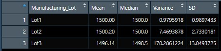
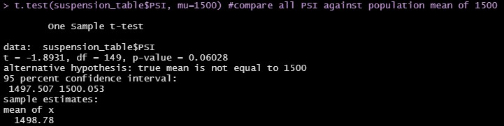
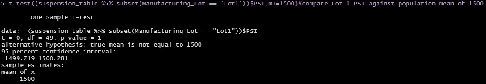
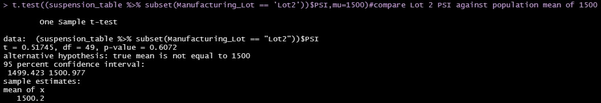
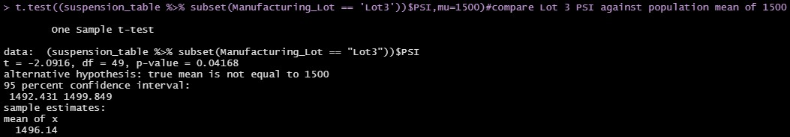

# MechaCar_Statistical_Analysis

---

## Linear Regression to Predict MPG

### Which variables/coefficients provided a non-random amount of variance to the mpg values in the dataset?
    According to our Pr(>|t|) values the two variables that have the greatest impact on mpg is vehicle_length and ground_clearance. 

### Is the slope of the linear model considered to be zero? Why or why not?
    Our P value is 5.35e-11, meaning that it is much smaller than our assumed significance level of 0.05%. This means the slope is not considered zero.
### Does this linear model predict mpg of MechaCar prototypes effectively? Why or why not?
    This graph does have an accurate depiction of mpg on MechaCar prototypes, however, we do see that there seems to be an overfit and may not predict future data correctly. 
---

## Summary Statistics on Suspension Coils
### The design specifications for the MechaCar suspension coils dictate that the variance of the suspension coils must not exceed 100 pounds per square inch. Does the current manufacturing data meet this design specification for all manufacturing lots in total and each lot individually? Why or why not?
    Looking at the following image we can see that our overall data shows a variance under 100 PSI, suggesting that overall manufacturing is meeting specifications. 

    Once we take a closer look at individual lot info, we see that Lot 3 is well over the 100 PSI variance. This tells us that the design of Lot 3 does not meet specifications.

---

## T-Tests on Suspension Coils
- Summary of all lots, 1 sample test, Mean of 1500 PSI. P-value indicates greater than 0.05% showing no statistical differnece between total population mean and mean of 1500 PSI.

- Summary of lot 1, 1 sample test, Mean of 1500 PSI. P-value indicates greater than 0.05% showing no statistical differnece between lot 1 mean and mean of 1500 PSI.

- Summary of all lots, 1 sample test, Mean of 1500 PSI. P-value indicates greater than 0.05% showing no statistical differnece between lot 2 mean and mean of 1500 PSI.

- Summary of all lots, 1 sample test, Mean of 1500 PSI. P-value indicates less than 0.05% showing statistical differnece between lot 3 mean and mean of 1500 PSI. This is more evidence showing lot 3 needs attention.

---

## Study Design: MechaCar vs Competition

In this description we are going to determine a statistical study that quantifies how MechaCar performs against its competition. 

1) What metric or metrics are we going to test?
    - Vehicle Cost
    - City MPG rating
    - Highway MPG rating
    - Safety rating
    - Vehicle type
2) What is the null hypothesis or alternative hypothesis?
    - Null Hyptothesis: MechaCar is priced correctly based on its fuel efficiency, type, and safety ratings.
3) What statistical test will we use to test the hypothesis and why? 
    - Sample testing against competitors with vehicle cost and vehicle type.
    - Multiple Linear Regression to determine which variables have the greatest impact on vehicle cost.
4) What data is needed to run the statistical test?
    - We will need data from competitors with their average cost, efficiency ratings, safety ratings, and listed type. We can then compare this data with our own to determine competive prices within profit margins.